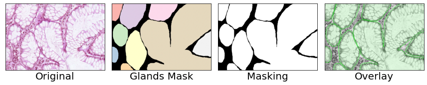

# Gland-Segmentation
## [GlaS@MICCAI'2015: Gland Segmentation Challenge Contest](https://warwick.ac.uk/fac/cross_fac/tia/data/glascontest/)

In this challenge, participants are encouraged to run their gland segmentation algorithms on images of Hematoxylin and Eosin (H&E) stained slides, consisting of a variety of histologic grades. The dataset is provided together with ground truth annotations by expert pathologists. The participants are asked to develop and optimise their algorithms on the provided training dataset, and validate their algorithm on the test dataset.

## Structure
### CSV Files
`Grade.csv` is the original spreadsheet provided by the organiser. 

`data.csv` is the post-processed spreadsheet with additional information for dataloading. 

### Notebooks
`EDA.ipynb` provides description about data understanding, data analyses of the dataset. 

`dataloader.ipynb` provides description about the data loading pipeline for training data set and testing data set. This includes data augmentation and data preprocessing inside the data loader pipeline. 

`inference_testB.ipynb` *attempts to provide an overview about the model used, hyperparameters, metrics result and visualisation of the inputs. This notebook computes the inference on data set testB. (Please view this notebook for primary reference on inferece). 

`inference_testA.ipynb` This notebook computes the inference on testA.

### Python Files
These files contains helper functions or module for visualisation, model traning, evaluation and metrics. 

`utils.py` contains utility functioons mainly for visualisation purpose and preprocessing functions. 

`metric.py` contains functions to calculate evaluation metrics, which includes, F1 score, Object Dice Score, Object Hausdorff Distance, Dice Score and Hausdorff Distance. This python file is adapted from repo by [Hans Pinckaers](https://github.com/DIAGNijmegen/neural-odes-segmentation) . 

`train.py` is the main python file for model training. The training runs are all recorded in `Weights & Biases` cloud storage. 

`model.py` contains experimental models under testing phase.

## Results 
The metrics for segmentated mask evaluation is precision, recall, F1 score, dice score and Hausdorff Distance. The output results are evaluated on pixel-wise segmentation (binary mode) instead of gland-wise segmentation. 

|   | Precision  | Recall | F1 Score | Dice Score | Hausdorff Distance |
| :-------------: | :-------------: | :-------------: | :-------------: | :-------------: | :-------------: |
| testA  | 0.93 (0.06)  | 0.93 (0.06) | 0.93 (0.06) | 0.93 (0.07) | 83.35 (66.77) |
| testB  | 0.90 (0.08)  | 0.90 (0.08) | 0.90 (0.08) | 0.91 (0.07) | 62.36 (33.02) |

|Test A|Test B|
|:--:|:--:|
|||

## Visualisation 
Binary Segmentation of ground truth and predicted masking. 

Overlay segmentation plot of ground truth and predicted masking. 

Overlay boundary plot of ground truth and predicted masking for Hausdorff Distance.  

## Future Work
Gland-wise segmentation of ground truth and predicted masking is possible. The evaluation metric for object dice score, object F1 score and object Hausdorff Distance reserved for future investigation. 

## Requirements 
### Third Party Library
- Segmentaion models API in PyTorch by [Pavel Yakubovskiy](https://github.com/qubvel/segmentation_models.pytorch): `$ pip install segmentation-models-pytorch`
- Data loader module for medical images by [MIC-DKFZ](https://github.com/MIC-DKFZ/batchgenerators): `$ pip install --upgrade batchgenerators`

### Dependencies 
`$ pip install requirements.txt`

